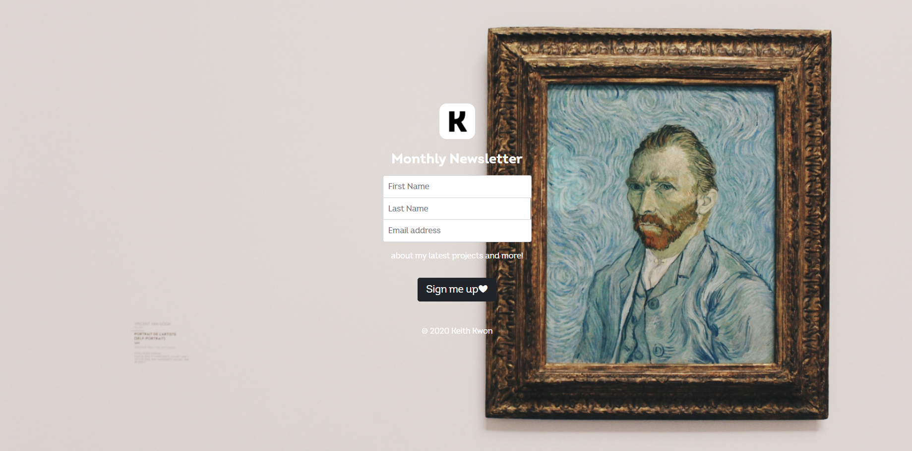
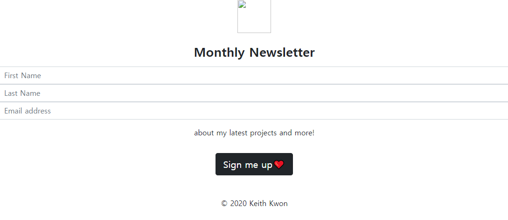
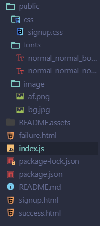
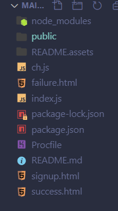
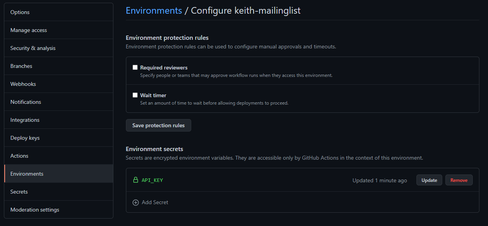
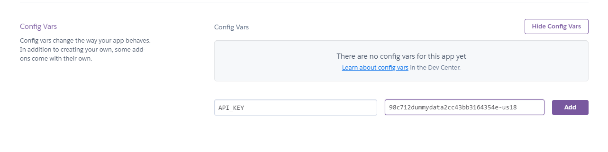
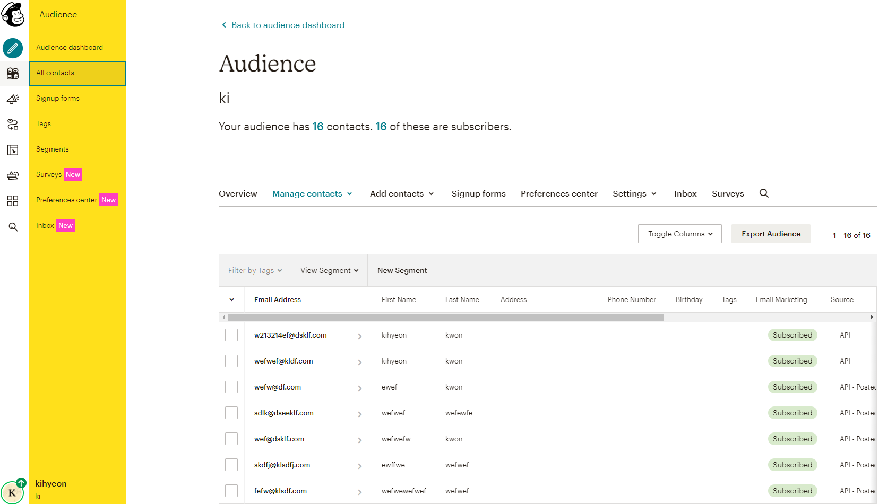
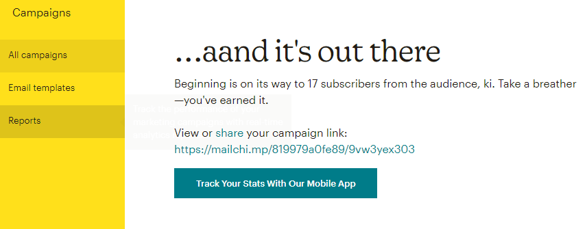

# Mailing List

> Make a mailing list subscription page with Node Express. Deployed on Heroku.


[Check final product here!](https://keith-mailinglist.herokuapp.com/)


1. Server with Node Express.
2. Mailchimp API to send mailing information.
3. Deployed on Heroku.




## Server with Node Express 

### #Express #Node

### Flow

1. `npm init`

2. `npm i express body-parser request`

3. Build basic setup

   ```js
   const express = require("express");
   const bodyParser = require("body-parser");
   const request = require("request");
   const path = require("path");
   
   const app = express();
   const port = 3000;
   
   app.use(express.static("public"));
   
   app.listen(port, () => {
     console.log("listening");
   });
   
   app.get("/", (req, res) => {
     res.sendFile(path.join(__dirname, "/signup.html"));
   });
   
   ```

   

4. Static Files




CSS and image file is gone when we check on localhost:3000. This is because those files were local. We need to change them to static files in order to send them. 

```js
//index.js
app.use(express.static("public"));

```




```html
<link href="css/signup.css" rel="stylesheet" />
```

Change the url to relative url starting from 'Public' folder.


```css
  background-image: url("../image/bg.jpg");
```

In case of CSS, starting from the CSS file to destination


```CSS
@font-face {
  font-family: "Intro";
  src: url("fonts/normal_normal_normal.woff2") format("woff2");
}

@font-face {
  font-family: "Intro";
  src: url("fonts/normal_normal_bold.woff2") format("woff2");
  font-weight: bold;
}
```

font doesn't seem to mind to begin from public folder. Or maybe its cache. Doesnt seem to affect font although I deliberately changed the URL to nonsense. Must **check later**.

5. POST and Parse

   ```js
   app.use(bodyParser.urlencoded({extended:true}))
   // if you don't use bodyParser `req.body` returns undefined.
   
   
   app.post("/", (req, res) => {
     console.log(req.body);
     const firstName = req.body.firstName;
     const lastName = req.body.lastName;
     const emailAddress = req.body.emailAddress;
   });
   ```


### Notes

### #static files #bodyParser

1. Static files
2. `app.use(bodyParser.urlencoded({extended:true}))` What is bodyParser? urlencoded? and extended? Why do we need to install it if it is so fundamental?


---


## MailChimp API

> [MailChimp Quickstart](https://mailchimp.com/developer/guides/marketing-api-quick-start/)

1. You can control your mail list for marketing purpose. 
2. Lists/Audience means a group. Member/contact means a person.
3. You can create one list if you're a free tier user, and add members to it.
4. They have their own package to make things easy `npm install @mailchimp/mailchimp_marketing`. 


### Flow


1. Use the boilerplate code to check if its ok, but first you need to set `"type":"module"` at package.json to import stuffs. 

   ```js
   import mailchimp from "@mailchimp/mailchimp_marketing";
   // this part does not work on normal package. 
   
   mailchimp.setConfig({
     apiKey: "longnumbersofAPIkey",
     server: "us00",
   });
   
   async function run() {
     const response = await mailchimp.ping.get();
     console.log(response);
   }
   
   run();
   
   ```

2. After testing, you can add to the mailing list with

   ```js
   const mailchimp = require("@mailchimp/mailchimp_marketing");
   const listId = "You can find it at MailChimp";
   
   mailchimp.setConfig({
     apiKey: "api",
     server: "us00",
   });
   
   app.post("/", (req, res) => {
     console.log(req.body);
     const firstName = req.body.firstName;
     const lastName = req.body.lastName;
     const emailAddress = req.body.emailAddress;
     const subscribingUser = {
       firstName: firstName,
       lastName: lastName,
       email: emailAddress,
     };
   
     async function run() {
       try {
         const response = await mailchimp.lists.addListMember(listId, {
           email_address: subscribingUser.email,
           status: "subscribed",
           merge_fields: {
             FNAME: subscribingUser.firstName,
             LNAME: subscribingUser.lastName,
           },
         });
         console.log(
           `Successfully added contact as an audience member. The contact's id is ${response.id}.`
         );
         res.sendFile(__dirname + "/success.html");
       } catch (error) {
         console.log(error);
         res.sendFile(__dirname + "/failure.html");
       }
     }
   
     run();
   
   ```

   


### Notes

### #POP #IMAP #SMTP #async #await #asynchronous #promise #callback

1. What is POP and IMAP SMTP?

2. AsyncFunction

   > Newer way to implement promise and callback functions. 

   ```js
   function resolveAfter2Seconds() {
     return new Promise(resolve => {
       setTimeout(() => {
         resolve('resolved');
       }, 2000);
     });
   }
   
   async function asyncCall() {
     console.log('calling');
     const result = await resolveAfter2Seconds();
     console.log(result);
     // expected output: "resolved"
   }
   
   asyncCall();
   
   //Using await inside aync function allows you to write cleaner style promises
   ```

   ```js
   //How to use then/catch -> try/catch
   
   async function logTodoTitle() {
     try {
       var user = await fetchUser();
       if (user.id === 1) {
         var todo = await fetchTodo();
         console.log(todo.title);
       }
     } catch (error) {
       console.log(error);
     }
   }
   ```

3. Promise

   > **“A promise is an object that may produce a single value some time in the future”** . An object used for asynchronous . 

4. Asynchronous / Callback

## Deploy on Heroku

> Cloud platform as a service (Paas) started in 2007, initially only supported Ruby. Now supports Java, Node.js, Scala, Clojure, Python, PHP and Go. Acquired by Salesforce in 2012. The name "Heroku" is a portmanteau of "heroic" and "haiku". The Japanese theme is a nod to Matz for creating Ruby. [Wikipedia](https://en.wikipedia.org/wiki/Heroku)

### Flow 

1. First install heroku cli

   `npm i -g heroku`

2. Change port

   ```js
   const port = process.env.PORT;
   
   app.listen(port || 3000, () => {
     console.log("listening");
   });
   //The || lets you allow locally and deployed
   ```

   

3. Create procfile

   

   ```js
   //Procfile
   web: node index.js
   ```

   This step might not be necessary anymore.

4. You can either push directly to heroku or use github to deploy. I'll try using github.

5. Make repository and push to github. Go to heroku app and integrate with repository, deployment is easy but


### .env files and API_KEYS

### #.env 

As soon as I pushed, my API_KEYS which were included in the index.js file was compromised and disabled. I should never do this again. I had to find a way around. 

`npm i dotenv`

```javascript


require('dotenv').config();

mailchimp.setConfig({
  apiKey: process.env.API_KEY,
  server: "us18",
});


```

```javascript
// .env file
API_KEY="98c71dummydatacc43bb3164354e-us18"
```

but how to use it deployed?

First try




```
Error: Unauthorized
```


Second try




Finally works!!!







Sent my first newsletter to my friends!


### Notes

1. What is Redis? What is PostgreSQL?
2. What does process.env have?
3. What is a websocket?
4. How to use .env files
5. What is github actions? 